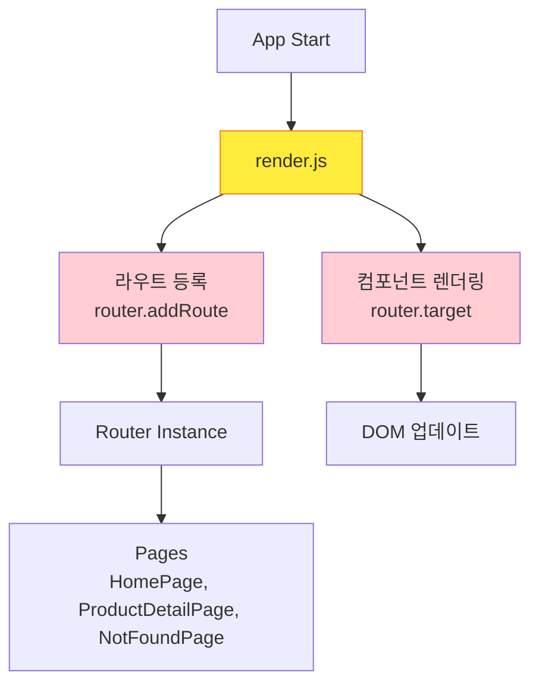
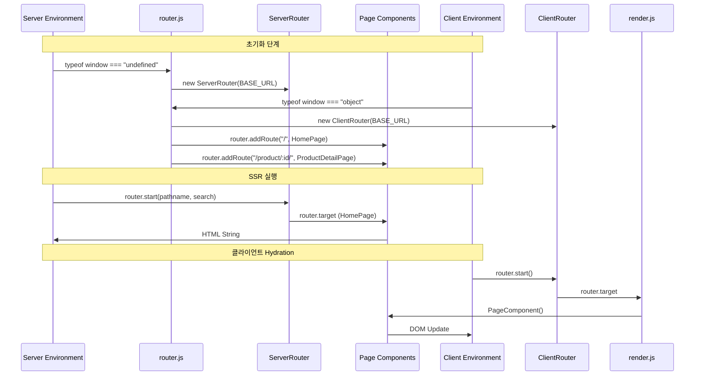

# 라우팅 리팩터링 Q&A

## Q1: 지금 staged된 코드는 직접 render되는 부분에서 페이지 분기 처리를 router로 옮겼다는 건 알겠어. 하지만 구체적인 부분은 잘 이해가 안가네. 이에 대해서 설명해주겠어?

### A1: 라우트 설정 위치를 변경해서 SSR 대응과 관심사 분리를 달성했습니다!

## 변경 전 vs 변경 후

### **변경 전 (render.js에서 라우트 등록)**
```javascript
// render.js에서 라우트 등록
import { HomePage, NotFoundPage, ProductDetailPage } from "./pages";

router.addRoute("/", HomePage);
router.addRoute("/product/:id/", ProductDetailPage);
router.addRoute(".*", NotFoundPage);

export const render = withBatch(() => {
  const PageComponent = router.target;
  rootElement.innerHTML = PageComponent();
});
```

### **변경 후 (router.js에서 라우트 등록)**
```javascript
// router/router.js에서 라우트 등록
import { ClientRouter, ServerRouter } from "../lib";
import { HomePage, ProductDetailPage, NotFoundPage } from "../pages";

// 환경에 따라 다른 라우터 사용
export const router = typeof window === "undefined" 
  ? new ServerRouter(BASE_URL) 
  : new ClientRouter(BASE_URL);

router.addRoute("/", HomePage);
router.addRoute("/product/:id/", ProductDetailPage);
router.addRoute(".*", NotFoundPage);
```

```javascript
// render.js는 단순화됨
export const render = withBatch(() => {
  const PageComponent = router.target;  // 라우터에서 컴포넌트만 가져옴
  rootElement.innerHTML = PageComponent();
});
```

## 왜 이렇게 바꾼 거야?

### 1. **SSR 대응**
```javascript
// 서버와 클라이언트에서 동일한 라우팅 설정 공유
export const router = typeof window === "undefined" 
  ? new ServerRouter(BASE_URL)    // 서버에서 실행
  : new ClientRouter(BASE_URL);   // 클라이언트에서 실행
```

**핵심:** 서버와 클라이언트가 다른 라우터를 사용하지만, **동일한 라우트 설정**을 공유합니다.

### 2. **관심사 분리**
- **이전**: `render.js`가 렌더링 + 라우팅 설정 담당
- **이후**: `router.js`는 라우팅만, `render.js`는 렌더링만 담당

### 3. **중앙집중식 라우팅**
- 모든 라우트 설정이 `router.js` 한 곳에 모임
- 서버와 클라이언트가 동일한 라우트 설정 사용
- 라우트 추가/수정 시 한 곳에서만 관리

## 구체적인 실행 흐름

### 서버에서의 흐름
```javascript
// 1. router.js에서 ServerRouter 생성 + 라우트 등록
export const router = new ServerRouter(BASE_URL);
router.addRoute("/", HomePage);

// 2. 서버에서 SSR 시
router.start(req.pathname, req.search);  // 서버 전용 메서드

// 3. render.js에서 라우터가 찾은 컴포넌트 렌더링
const PageComponent = router.target;  // HomePage 컴포넌트
return PageComponent();  // HTML 문자열 반환
```

### 클라이언트에서의 흐름
```javascript
// 1. router.js에서 ClientRouter 생성 + 라우트 등록 (동일한 설정)
export const router = new ClientRouter(BASE_URL);
router.addRoute("/", HomePage);

// 2. 클라이언트에서 네비게이션 시
router.push("/product/123");  // 클라이언트 전용 메서드

// 3. render.js에서 라우터가 찾은 컴포넌트 렌더링
const PageComponent = router.target;  // ProductDetailPage 컴포넌트
rootElement.innerHTML = PageComponent();  // DOM에 렌더링
```

## 변경의 핵심 이점

### 1. **동일한 라우트 설정**
```javascript
// 서버와 클라이언트 모두 동일한 라우트 사용
router.addRoute("/", HomePage);
router.addRoute("/product/:id/", ProductDetailPage);
router.addRoute(".*", NotFoundPage);
```

### 2. **환경별 최적화**
- **ServerRouter**: `window` 없이 동작, 정적 라우팅
- **ClientRouter**: 브라우저 API 활용, 동적 네비게이션

### 3. **코드 구조 개선**
- `render.js`: 순수하게 렌더링 로직만
- `router.js`: 라우팅 설정과 환경 분기 담당

## 아키텍처 비교

### 변경 전 아키텍처


### 변경 후 아키텍처
```mermaid
graph TD
    A[App Start] --> B{Environment Check<br/>typeof window}
    B -->|undefined| C[ServerRouter]
    B -->|object| D[ClientRouter]
    
    E[router.js] --> F[라우트 등록<br/>router.addRoute]
    F --> G[Pages<br/>HomePage, ProductDetailPage, NotFoundPage]
    
    C --> H[server.js<br/>SSR Rendering]
    D --> I[render.js<br/>Client Rendering]
    
    H --> J[router.start(pathname, search)]
    I --> K[router.target]
    
    J --> L[HTML String Return]
    K --> M[DOM 업데이트]
    
    style E fill:#4caf50
    style E stroke:#2e7d32
    style B fill:#2196f3
    style B stroke:#1976d2
    style C fill:#ff9800
    style D fill:#ff9800
```

### SSR 환경에서의 전체 흐름


## Q2: 그럼 ssr에서도 렌더링은 render.js에서 이뤄지는거야? ssr이 이뤄질때의 렌더링이 잘 이해가 안가는데?

### A2: 아니요! SSR과 클라이언트 렌더링은 **완전히 다른 파일**에서 이뤄집니다.

## SSR vs 클라이언트 렌더링 비교

### **클라이언트 렌더링** (`render.js`)
```javascript
// src/render.js - 브라우저에서 실행
export const render = withBatch(() => {
  const rootElement = document.getElementById("root");  // ✅ DOM 존재
  const PageComponent = router.target;
  rootElement.innerHTML = PageComponent();  // DOM에 직접 업데이트
});
```

### **SSR 렌더링** (`main-server.js`)
```javascript
// src/main-server.js - 서버에서 실행
export const render = async (url, query) => {
  // 현재는 빈 문자열만 반환
  console.log({ url, query });
  return "";  // HTML 문자열 반환 (DOM 없음)
};
```

## 실제 SSR 흐름

```javascript
// server.js에서 SSR 처리
app.use("*", async (req, res) => {
  // 1. 서버용 render 함수 가져오기
  const render = (await vite.ssrLoadModule("/src/main-server.js")).render;
  
  // 2. 서버에서 HTML 문자열 생성
  const rendered = await render(url, req.query);  // main-server.js의 render
  
  // 3. HTML 템플릿에 주입
  const html = template
    .replace(`<!--app-head-->`, rendered.head ?? "")
    .replace(`<!--app-html-->`, rendered.html ?? "");
    
  // 4. 클라이언트에 HTML 전송
  res.send(html);
});
```

## 핵심 차이점

| 환경 | 렌더링 파일 | 렌더링 방식 | 결과 |
|------|------------|-----------|------|
| **클라이언트** | `render.js` | DOM 조작 | `rootElement.innerHTML = ...` |
| **서버** | `main-server.js` | 문자열 생성 | `return { html: "...", head: "..." }` |

## 현재 `main-server.js`가 비어있는 이유

현재 `main-server.js`는 구현되지 않은 상태입니다:

```javascript
export const render = async (url, query) => {
  return "";  // 실제로는 여기서 라우터를 사용해서 HTML 생성해야 함
};
```

**실제로 구현되어야 할 모습:**
```javascript
export const render = async (url, query) => {
  // 1. 서버용 라우터로 컴포넌트 찾기
  router.start(pathname, search);
  const PageComponent = router.target;
  
  // 2. 컴포넌트를 HTML 문자열로 렌더링
  const html = PageComponent();
  
  // 3. HTML과 헤드 정보 반환
  return { 
    html: html,
    head: "" 
  };
};
```

**결론:** 
- **클라이언트**: `render.js`가 DOM에 직접 렌더링
- **서버**: `main-server.js`가 HTML 문자열을 생성해서 반환
- 두 파일은 **완전히 다른 역할**을 합니다!

## 전체 결론

**핵심:** 라우트 설정을 `router.js`로 옮겨서 서버와 클라이언트가 동일한 라우팅 로직을 공유하면서도, 각각의 환경에 최적화된 라우터를 사용할 수 있게 만든 것입니다!

이를 통해 SSR과 클라이언트 렌더링에서 일관된 라우팅을 보장하면서도, 코드의 관심사를 명확히 분리했습니다.