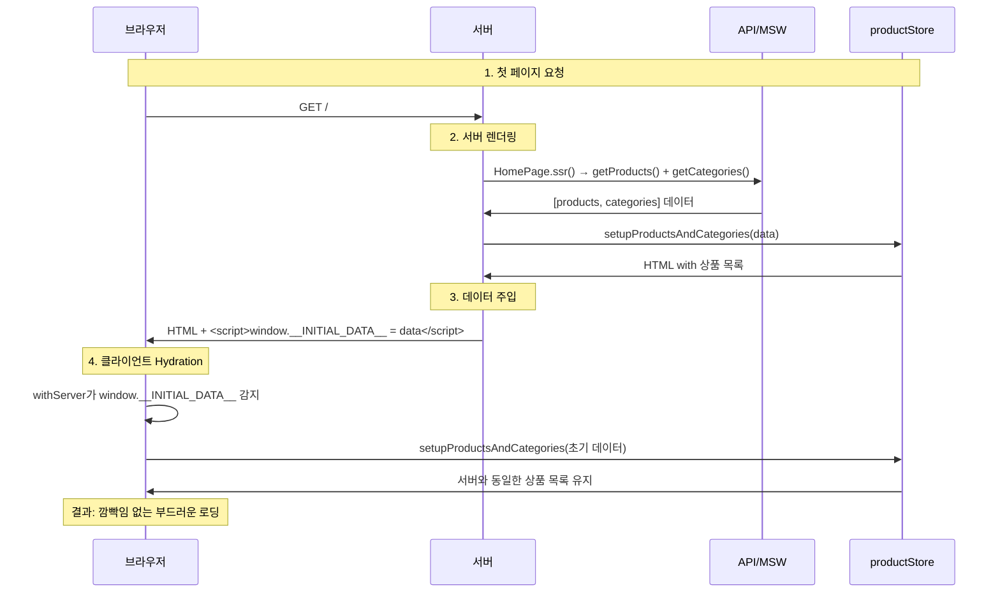

# SSR 초기 데이터 주입 Q&A

## Q1: 현재 staged된 코드들은 아마 ssr에서 초기 데이터를 주입하기 위한 코드 같은데, 정확히 어떤 부분에서 필요한지 설명해줘.

### A1: SSR에서 **Hydration Mismatch 해결**을 위해 서버에서 미리 데이터를 로드하고 클라이언트로 전달하는 구현입니다!

## Q2: 현재 staged에 있는 코드들이 어떤 동작을 하는지 위주로 설명해줘.

### A2: 현재 staged된 코드들의 동작을 단계별로 설명드리겠습니다.

## 1. **서버에서 초기 데이터 로드** (`main-server.js`)

```javascript
export const render = async (pathname, query) => {
  router.start(pathname, query);
  const data = (await router.target?.ssr({ pathname, query })) ?? {};
  return {
    head: "",
    html: router.target({ pathname, query, data }),
    __INITIAL_DATA__: data,
  };
};
```

**동작:**
1. 서버용 라우터로 현재 경로의 페이지 컴포넌트 찾기
2. 해당 페이지의 `ssr` 함수 실행해서 필요한 데이터 미리 로드
3. 데이터와 함께 HTML 렌더링 + 클라이언트로 전달할 데이터 준비

## 2. **HTML에 초기 데이터 주입** (`server.js`)

```javascript
const pathname = url.split("?")[0] || "/";
const rendered = await render(pathname, req.query);

const html = template
  .replace(`<!--app-html-->`, rendered.html ?? "")
  .replace(`APP_DATA`, JSON.stringify(rendered.__INITIAL_DATA__));
```

**동작:**
1. URL에서 pathname 추출
2. `main-server.js`의 render 함수로 서버 렌더링 실행
3. HTML 템플릿의 `APP_DATA`를 실제 서버 데이터로 교체해서 클라이언트에 전송

## 3. **클라이언트에서 데이터 접근** (`index.html`)

```javascript
<script>
  window.__INITIAL_DATA__ = APP_DATA;
</script>
```

**동작:**
- 서버에서 주입한 데이터를 `window.__INITIAL_DATA__`에 저장
- 클라이언트 코드에서 이 전역 변수로 서버 데이터에 접근 가능

## 4. **SSR/CSR 분기 처리** (`withServer.js`)

```javascript
export const withServer = ({ ssr }, page) => {
  const pageWithSSR = (...args) => {
    if (typeof window === "undefined") {
      return page(...args);  // 서버: 일반 렌더링
    }
    return page(...args, {   // 클라이언트: 초기 데이터 포함
      url: window.location.pathname,
      query: Object.fromEntries(new URLSearchParams(window.location.search)),
      data: window.__INITIAL_DATA__,
    });
  };
  pageWithSSR.ssr = ssr;
  return pageWithSSR;
};
```

**동작:**
1. `window` 객체 존재 여부로 서버/클라이언트 환경 판별
2. **서버**: 페이지를 일반적으로 렌더링
3. **클라이언트**: 서버에서 받은 초기 데이터(`window.__INITIAL_DATA__`)를 페이지에 전달

## 5. **HomePage에서 초기 데이터 사용**

```javascript
export const HomePage = withServer(
  {
    ssr: async ({ query }) => {
      return await Promise.all([getProducts(query), getCategories()]);
    },
  },
  ({ data } = {}) => {
    setupProductsAndCategories(data);
    // ... 렌더링 로직
  }
);
```

**동작:**
1. **서버에서**: `ssr` 함수가 상품과 카테고리 데이터를 미리 로드
2. **클라이언트에서**: `withServer`가 전달한 `data`(초기 데이터)로 store 설정
3. 서버와 클라이언트 모두 동일한 데이터로 렌더링 → **Hydration mismatch 방지**

## 6. **데이터 설정 함수 변경** (`productService.js`)

```javascript
export const setupProductsAndCategories = async ([
  { products, pagination: { total } },
  categories,
]) => {
  if (productStore.getState().status === "done") {
    return; // 이미 설정된 경우 중복 실행 방지
  }

  productStore.dispatch({
    type: PRODUCT_ACTIONS.SETUP,
    payload: {
      products, categories, totalCount: total,
      loading: false, status: "done",
    },
  });
};
```

**동작:**
1. 이미 로드된 데이터를 받아서 store에 설정만 함 (API 호출 X)
2. 중복 설정 방지를 위해 `status` 체크
3. 로딩 상태 없이 바로 완료 상태로 설정

## 전체 실행 흐름



## 핵심 동작 요약

1. **서버**: 페이지별 필요 데이터를 미리 로드하고 HTML과 함께 렌더링
2. **데이터 전달**: HTML 템플릿에 JSON 형태로 데이터 주입
3. **클라이언트**: 서버에서 받은 동일한 데이터로 store 설정
4. **결과**: 서버와 클라이언트가 동일한 HTML 생성 → **SSR의 이점과 CSR의 상호작용을 모두 확보**

이로써 **빠른 초기 로딩 + SEO 최적화 + 부드러운 사용자 경험**을 모두 달성하는 SSR 시스템이 완성됩니다!

## 핵심 문제: Hydration Mismatch

**기존 문제점:**
```javascript
// 서버: 빈 데이터로 HTML 렌더링
<div>Loading...</div>

// 클라이언트: API 호출 후 데이터 로드
<div>상품 목록 30개</div>  // ❌ 서버와 다른 HTML!
```

**결과:** 서버와 클라이언트가 다른 HTML을 생성해서 **Hydration Error** 발생

## Next.js와의 연관성

## Q3: Next js 에서 SSG로 빌드하면 정적빌드페이지가 생성되지만 첫 진입만 html을 받고 나머지는 json data형식으로 받아서 csr형태를 유지한다고 하는데, 이 내용과 현재 코드가 연관이 있어?

### A3: 네, 매우 밀접한 연관이 있습니다! 현재 구현한 코드가 Next.js의 **하이브리드 렌더링** 패턴과 거의 동일한 개념입니다.

## Next.js SSG의 하이브리드 패턴

### Next.js의 동작 방식
```javascript
// 첫 진입 (SSG)
GET / → 완성된 HTML 파일 (빌드 타임에 미리 생성)

// 이후 네비게이션 (CSR)
router.push('/about') → JSON 데이터만 요청 → 클라이언트에서 렌더링
```

### 현재 우리 구현과의 비교

**현재 우리 코드:**
```javascript
// 첫 진입 (SSR)
GET / → 서버에서 완성된 HTML + 초기 데이터 주입

// 이후 네비게이션 (CSR)  
router.push('/product/123') → 클라이언트에서 렌더링 + API 호출
```

## 구체적인 연관성

### 1. **초기 데이터 주입 패턴**
```javascript
// Next.js
export async function getStaticProps() {
  const data = await fetchData();
  return { props: { data } };
}

// 우리 구현
ssr: async ({ query }) => {
  return await Promise.all([getProducts(query), getCategories()]);
}
```

### 2. **클라이언트 데이터 재사용**
```javascript
// Next.js
function Page({ data }) {  // SSG에서 주입된 데이터
  return <div>{data}</div>;
}

// 우리 구현
({ data } = {}) => {  // SSR에서 주입된 데이터
  setupProductsAndCategories(data);
  return PageWrapper({ ... });
}
```

### 3. **하이브리드 렌더링**
```javascript
// Next.js
- 첫 페이지: 빌드된 HTML
- 네비게이션: JSON + CSR

// 우리 구현  
- 첫 페이지: SSR HTML + 초기 데이터
- 네비게이션: CSR + API 호출
```

## 차이점과 개선 가능한 부분

### Next.js의 추가 최적화
```javascript
// Next.js는 페이지별 JSON 파일도 미리 생성
/_next/static/chunks/pages/product/123.json  // 페이지 데이터
```

### 우리 코드에 적용하면
```javascript
// 현재: 모든 페이지가 SSR
GET /product/123 → 서버에서 HTML 생성

// 개선 가능: API 엔드포인트 추가
GET /api/page-data/product/123 → JSON 데이터만 반환
```

**개선된 라우터 구현:**
```javascript
// router에서 페이지 데이터만 별도 요청
router.push('/product/123', { prefetch: true });

// 내부적으로
fetch('/api/page-data/product/123')
  .then(data => setupPage(data))  // JSON으로 페이지 데이터만 받음
```

## 현재 코드의 Next.js 유사성

### 1. **getStaticProps와 ssr 함수**
```javascript
// Next.js
export async function getStaticProps() {
  return { props: { products: await getProducts() } };
}

// 우리 구현
ssr: async ({ query }) => {
  return await getProducts(query);
}
```

### 2. **__INITIAL_DATA__와 pageProps**
```javascript
// Next.js (내부적으로)
window.__NEXT_DATA__ = { props: { products: [...] } };

// 우리 구현
window.__INITIAL_DATA__ = [...];
```

### 3. **하이드레이션 과정**
```javascript
// Next.js
React.hydrate(<App pageProps={window.__NEXT_DATA__.props} />);

// 우리 구현  
setupProductsAndCategories(window.__INITIAL_DATA__);
```

## 결론

**현재 구현은 Next.js SSG의 핵심 개념을 바닐라 JS로 구현한 것입니다:**

1. ✅ **첫 진입**: 서버에서 완성된 HTML + 데이터 주입
2. ✅ **데이터 하이드레이션**: 클라이언트에서 서버 데이터 재사용  
3. ⚠️ **이후 네비게이션**: 아직 전체 SSR (개선 여지)

**Next.js 스타일로 더 최적화하려면:**
- 페이지별 JSON API 엔드포인트 추가
- 클라이언트 라우팅 시 JSON만 요청
- 데이터 프리페칭 구현

현재 코드는 이미 **SSR + 초기 데이터 주입**의 핵심을 구현했으므로, Next.js의 하이브리드 렌더링 패턴과 본질적으로 동일합니다!

## 분리된 진입점과 렌더링 로직

## Q4: 어떻게 분리된 진입점과 렌더링 로직을 가지고 있는지 설명해줄래?

### A4: 서버와 클라이언트는 완전히 독립적인 진입점과 렌더링 로직을 가지면서도, 동일한 컴포넌트를 공유합니다.

## 핵심 분리 포인트

### 1. **진입점 분리**
- **서버**: `server.js` → Express HTTP 요청 처리
- **클라이언트**: `main.js` → 브라우저 `<script>` 태그로 로드

### 2. **렌더링 로직 분리** 
- **서버**: `main-server.js` → HTML 문자열 반환 (`return "<div>..."`)
- **클라이언트**: `render.js` → DOM 직접 조작 (`element.innerHTML = ...`)

### 3. **라우터 분리**
```javascript
// 환경 감지로 다른 라우터 사용
export const router = typeof window === "undefined" 
  ? new ServerRouter(BASE_URL)    // window 객체 없이 동작
  : new ClientRouter(BASE_URL);   // 브라우저 API 사용
```

### 4. **실행 스택**
**서버:**
```
server.js → main-server.js → ServerRouter → 페이지.ssr → HTML 문자열
```

**클라이언트:**
```
main.js → render.js → ClientRouter → 페이지 컴포넌트 → DOM 조작
```

### 5. **빌드 결과물 분리**
```
dist/
├── vanilla/          # 클라이언트 번들
│   └── main.js       
└── vanilla-ssr/      # 서버 번들  
    └── main-server.js
```

## 핵심: 동일한 컴포넌트, 독립적인 실행 경로

서버와 클라이언트는 같은 페이지 컴포넌트를 사용하지만, 완전히 다른 방식으로 실행됩니다:
- **서버**: `main-server.js`에서 절대 실행되지 않음
- **클라이언트**: `main.js`에서 DOM 조작으로 동작
- **공통**: 동일한 컴포넌트와 라우팅 설정 공유